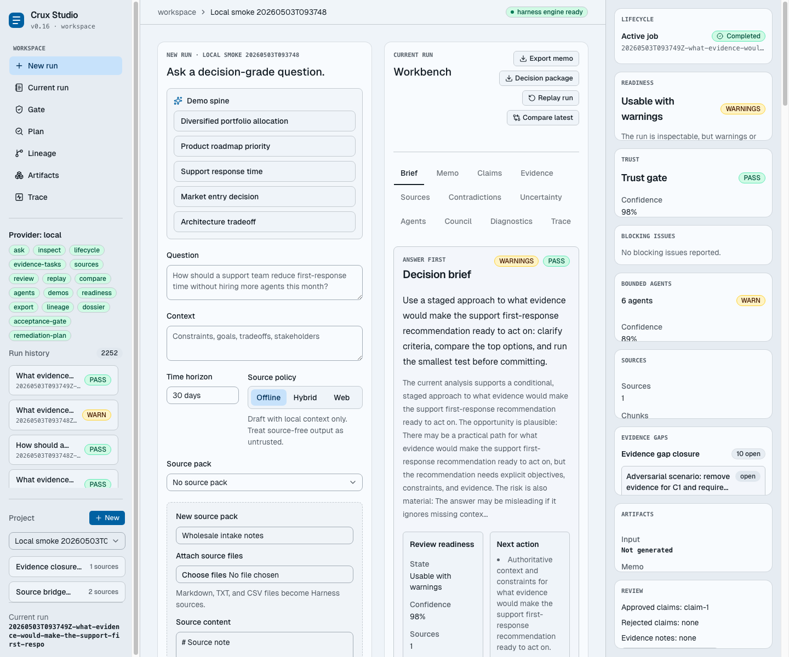
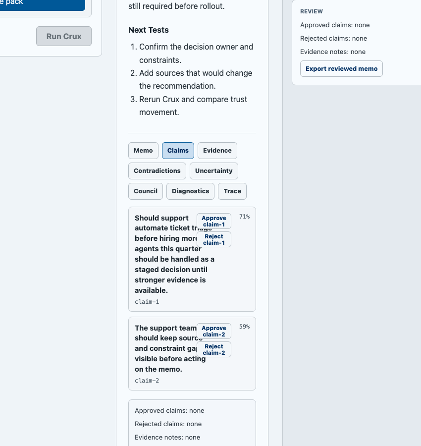
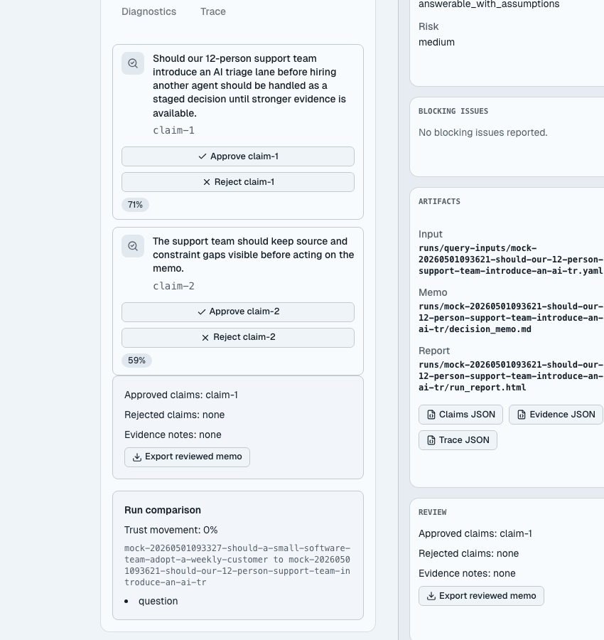
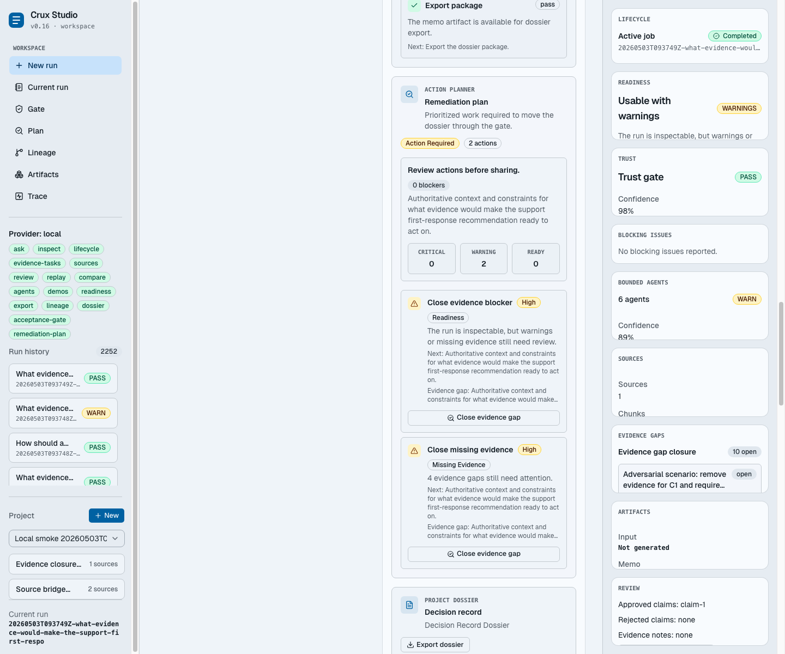

# Crux Studio

<p align="center">
  <strong>A workbench for turning agent analysis into inspectable, reviewable decisions.</strong>
</p>

<p align="center">
  <a href="#what-it-is">What it is</a>
  ·
  <a href="#how-it-works">How it works</a>
  ·
  <a href="#run-it">Run it</a>
  ·
  <a href="#architecture">Architecture</a>
</p>

<p align="center">
  
</p>

Crux Studio is a product interface for serious agent analysis.

It is built for the moment after someone asks an AI system an important question and needs more than a fluent answer. Crux Studio turns the answer into a structured run with a memo, claims, evidence, uncertainty, diagnostics, review actions, and a trace of what happened.

The goal is simple: make agent output easier to trust, challenge, improve, and share.

## What It Is

Crux Studio is not a chat app.

It is a decision workbench. You ask a question, add context, attach source material, run Crux, then inspect the result like a real artifact instead of treating the model response as a black box.

Use it for questions such as:

- Should our support team introduce AI triage before hiring another agent?
- Which product bet should we prioritize this quarter?
- What are the risks in this rollout plan?
- How should we compare two technical approaches?
- What evidence would change this recommendation?

Crux Studio is useful when an answer needs judgment, provenance, and iteration.

## Why It Exists

Most AI tools optimize for producing an answer quickly.

Crux Studio optimizes for making the answer usable:

- What is the recommendation?
- What claims does it depend on?
- What evidence supports those claims?
- What is uncertain?
- What could be wrong?
- What should a human review before acting?
- What changed after better context was added?

That makes it a better fit for operational decisions, product strategy, technical tradeoffs, policy review, support workflows, market analysis, and internal planning.

## How It Works

```text
Ask a question
-> Add context and source material
-> Run Crux
-> Read the decision brief
-> Inspect claims, evidence, sources, uncertainty, bounded agents, diagnostics, council output, and trace
-> Review claims and annotate evidence
-> Replay with better inputs
-> Compare runs
-> Read the project lineage
-> Assemble the decision record dossier
-> Check the acceptance gate
-> Follow the remediation plan
-> Export the dossier or decision package
```

## Product Tour

### Ask A Decision-Grade Question

Start with a question, practical context, a time horizon, and an optional source pack. Studio keeps the input focused on the decision, not on prompt engineering.

### Read The Decision Brief

Every completed run opens on a short decision brief first: recommendation, readiness, confidence, source coverage, next action, and blockers. The full memo and artifact trail stay one click away.

### Inspect The Run

Every run produces a memo plus structured artifacts. You can inspect the trust gate, confidence, answerability, risk, blocking issues, artifact paths, claims, evidence, contradictions, uncertainty, council output, diagnostics, and trace.

### Review Claims And Evidence

Claims can be approved or rejected. Evidence can be annotated. The goal is to move from "the agent said this" to "we reviewed what this answer depends on."

<p align="center">
  
  
</p>

### Improve And Compare

Studio supports replaying a run with the same question and context, comparing the latest runs, reading the decision lineage, assembling a dossier, checking whether the dossier is accepted, needs review, or is blocked, and following a remediation plan for whatever still needs work.

<p align="center">
  
</p>

### Accept And Export

The decision record combines the final recommendation, readiness, trust, source coverage, human review, lineage movement, key artifacts, and memo into one Markdown package. The acceptance gate scores the dossier before sharing, and the remediation plan turns weak evidence, blockers, missing review, and export readiness into prioritized next actions.

## Current Capabilities

- Ask arbitrary analysis and decision questions.
- Organize work into projects.
- Create source packs from pasted material or selected Markdown, TXT, and CSV files.
- Attach source packs to runs.
- Materialize attached source packs into real local Crux Harness source packs, inventories, and chunks.
- Reopen the latest run automatically when returning to the workspace.
- Land on an answer-first decision brief for every completed run.
- Submit new runs through an async lifecycle with queued, running, completed, failed, cancelled, and retry states.
- Recover lifecycle job history across local server restarts, resume queued jobs, and make interrupted running jobs retryable.
- Convert missing evidence, blockers, and source-related agent next actions into evidence closure tasks.
- Resolve evidence tasks with source notes, then automatically create a source pack, rerun, and compare the improved run.
- Read a decision delta report that explains what changed between two runs, why trust moved, which evidence gaps closed, which blockers remain, and what to do next.
- Export the decision delta as a Markdown package with the newer memo and human review context.
- See a project-level decision lineage that connects source packs, runs, evidence tasks, reruns, and decision deltas.
- Read a project-level decision record dossier that combines the final recommendation, review state, source summary, lineage, latest delta, key artifacts, and next step.
- Check a project-level acceptance gate that says whether the latest dossier is ready to share, needs review, or is blocked.
- Follow a project-level remediation plan that turns non-passing gate checks into prioritized source, evidence, review, rerun, blocker, regeneration, and export actions.
- Export the decision record dossier as Markdown.
- Start from canonical demo questions.
- Inspect the memo, claims, evidence, sources, contradictions, uncertainty, bounded agents, council output, diagnostics, and trace.
- See run readiness as ready, usable with warnings, or blocked.
- Review claims with approve and reject actions.
- Annotate evidence.
- Replay runs with the same context.
- Compare recent runs, read a decision delta, and export the comparison package.
- Open raw Claims, Evidence, Agents, and Trace JSON.
- Export the memo as Markdown.
- Export a reviewed memo that includes human review state.
- Export a full decision package with readiness, trust, agents, sources, review, and memo content.

## Run It

Install dependencies:

```bash
pnpm install
```

Start Studio:

```bash
pnpm dev
```

Start against a local Crux Harness checkout:

```bash
pnpm dev:local
```

Open:

```text
http://127.0.0.1:5173
```

The API server runs at:

```text
http://127.0.0.1:4318
```

Studio state is written to `.studio/studio-state.json`. That file is ignored by git so local runs and pasted source material do not become repository changes.

## Use It With Crux Harness

Crux Studio is a separate codebase from `crux-harness`. The web app talks to a server-side provider interface instead of importing harness internals directly.

To run Studio against a local Crux Harness checkout:

```bash
CRUX_STUDIO_PROVIDER=local \
CRUX_HARNESS_ROOT=/Users/nikolacehic/Desktop/crux-harness \
pnpm --filter @crux-studio/server dev
```

Then run the web app in another terminal:

```bash
pnpm --filter @crux-studio/web dev
```

For fast UI and product work, the default mock provider is enough:

```bash
pnpm dev
```

## Architecture

```text
Studio Web UI
-> Studio Server
-> CruxProvider interface
-> MockCruxProvider or LocalCruxHarnessProvider
-> Crux Harness
```

Repository layout:

```text
crux-studio/
  apps/
    web/          React Studio interface
    server/       API, persistence, provider adapters
  packages/
    crux-provider Shared provider contract
  docs/
    Product, UX, architecture, plan, trace, and screenshot assets
```

Key files:

```text
apps/web/src/App.tsx
apps/web/src/api.ts
apps/web/src/styles.css
apps/server/src/app.ts
apps/server/src/studio-store.ts
apps/server/src/providers/local-crux-provider.ts
packages/crux-provider/src/types.ts
packages/crux-provider/src/mock.ts
```

## Quality

Run tests:

```bash
pnpm test
```

Run TypeScript checks:

```bash
pnpm check
```

Build the project:

```bash
pnpm build
```

Run the full verification gate:

```bash
pnpm verify
```

Smoke check a running local Studio:

```bash
pnpm smoke:local
```

The smoke check creates source-backed lifecycle jobs, verifies durable lifecycle history, closes an evidence task with a source note, reruns Crux, compares the improved run, exports the delta package, validates the project lineage, validates the decision record dossier export, checks the acceptance gate, and validates the remediation plan.

The project is developed with a TDD-first workflow. Product behavior is covered across the provider package, server API, and web app.

## Current Boundary

Crux Studio is currently focused on the workbench experience: asking, inspecting, reviewing, replaying, comparing, and exporting runs.

It is intentionally not a hosted team control plane yet. Authentication, teams, permissions, hosted database, object storage, background jobs, deployment observability, and audit logs are out of scope for this stage.

## Documentation

- [Product spec](docs/PRODUCT_SPEC.md)
- [UX spec](docs/UX_SPEC.md)
- [Architecture spec](docs/ARCHITECTURE_SPEC.md)
- [Phased plan](docs/PHASED_PLAN.md)
- [Productization plan](docs/PRODUCTIZATION_PLAN.md)
- [Phase execution protocol](docs/PHASE_EXECUTION_PROTOCOL.md)
- [Phase 10 answer-first brief spec](docs/PHASE_10_ANSWER_FIRST_DECISION_BRIEF_SPEC.md)
- [Phase 11 async lifecycle spec](docs/PHASE_11_ASYNC_RUN_LIFECYCLE_SPEC.md)
- [Phase 12 durable lifecycle recovery spec](docs/PHASE_12_DURABLE_LIFECYCLE_RECOVERY_SPEC.md)
- [Phase 13 evidence gap closure spec](docs/PHASE_13_EVIDENCE_GAP_CLOSURE_SPEC.md)
- [Phase 14 decision delta report spec](docs/PHASE_14_DECISION_DELTA_REPORT_SPEC.md)
- [Phase 15 exportable decision delta package spec](docs/PHASE_15_EXPORTABLE_DECISION_DELTA_PACKAGE_SPEC.md)
- [Phase 16 decision lineage timeline spec](docs/PHASE_16_DECISION_LINEAGE_TIMELINE_SPEC.md)
- [Phase 17 decision record dossier spec](docs/PHASE_17_DECISION_RECORD_DOSSIER_SPEC.md)
- [Phase 18 decision record acceptance gate spec](docs/PHASE_18_DECISION_RECORD_ACCEPTANCE_GATE_SPEC.md)
- [Phase 19 acceptance gate remediation planner spec](docs/PHASE_19_ACCEPTANCE_GATE_REMEDIATION_PLANNER_SPEC.md)
- [Demo guide](docs/DEMO_GUIDE.md)
- [Trace log](docs/TRACE_LOG.md)
- [Changelog](CHANGELOG.md)
- [Product context](PRODUCT.md)
- [Design context](DESIGN.md)

## Product Position

Crux Studio is for people who do not just want an answer.

They want to know why the answer exists, what evidence holds it up, what could break it, and what changed after better context was added.

That is the product: more usable agent judgment.
